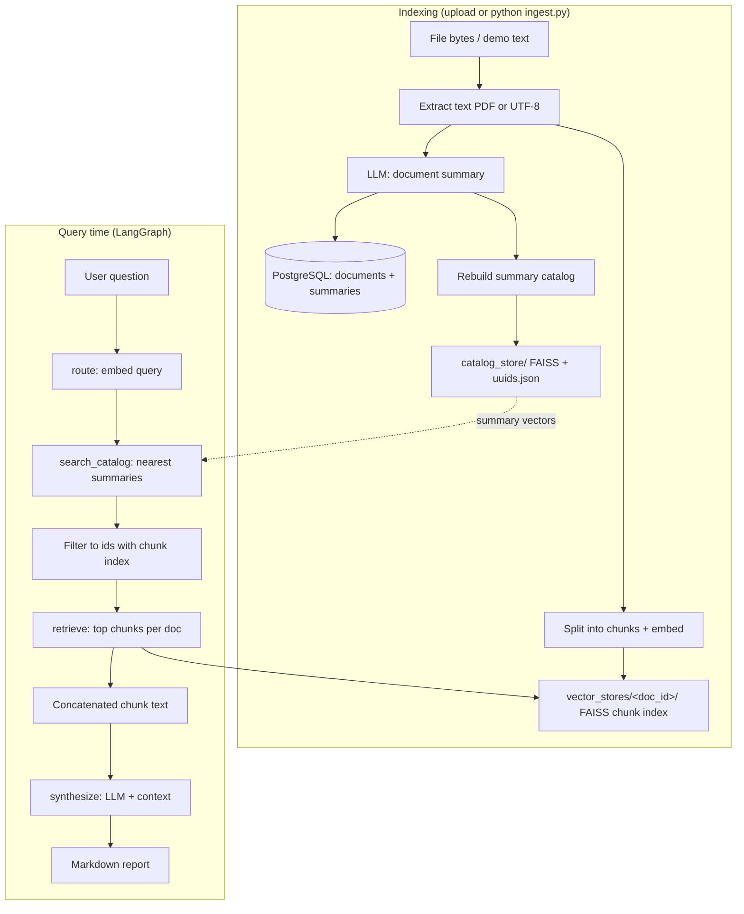
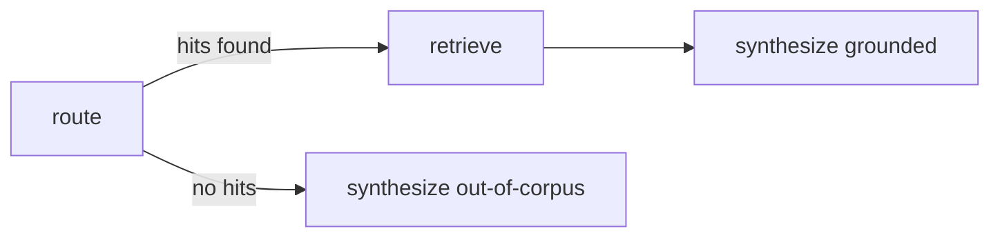

# Multi-Document Research Agent

RAG-style app: **document summaries** and **per-document chunk indexes** back a **LangGraph** agent. Queries are **routed** by embedding against the summary index (`catalog_store/`), then **chunks** are fetched from `vector_stores/<document_id>/`, and an **LLM** (Ollama) synthesizes the answer. **Streamlit** (`app.py`) provides the UI; **PostgreSQL** stores upload metadata and summaries.

## Pipeline (overview)



**Flow in words:** ingest builds **two** vector layers—**one embedding per document** (from the LLM summary, written to `catalog_store/`) and **many embeddings per document** (chunks in `vector_stores/<id>/`). At question time, the query embedding selects **which documents** matter (summary search), then the **same** query embedding runs **inside each chosen document’s** chunk index to pull evidence for synthesis.

## LangGraph shape



## Storage layout

| Path | Contents |
|------|----------|
| **`catalog_store/catalog.faiss`** | FAISS index over **document-level** embedding vectors (summaries; demo docs use a text snippet). |
| **`catalog_store/uuids.json`** | Maps FAISS row index → `document_id` string (UUID or e.g. `company_a_q3`). |
| **`vector_stores/<document_id>/`** | Per-document **chunk** FAISS (`index.faiss`) + LangChain docstore (`index.pkl`) with chunk text. |
| **`uploads/`** | Original uploaded files. |
| **PostgreSQL** | `documents` table: id, filename, `summary`, status, paths. |

## Setup

```bash
cd MultiDoc_Research_Agent
python -m venv .venv
source .venv/bin/activate   # Windows: .venv\Scripts\activate
pip install -r requirements.txt
cp .env.example .env        # set DATABASE_URL, Ollama models
```

Start Postgres (example):

```bash
docker compose up -d
```

Build demo chunk indexes + summary catalog (optional):

```bash
python ingest.py
```

## Run

**CLI (sample question):**

```bash
python main.py
```

**Streamlit UI:**

```bash
streamlit run app.py
# or: ./run_streamlit.sh
```

Configuration knobs for routing live in **`.env`** (see **`.env.example`**: `CATALOG_ROUTE_TOP_K`, `CATALOG_ROUTE_MAX_L2`, etc.).

## Key modules

| Module | Role |
|--------|------|
| `catalog/ivf_pq_faiss.py` | Build / save / **search** the summary FAISS catalog. |
| `catalog/routing.py` | `route_query_to_documents`: summary search ∩ chunk-indexed ids. |
| `catalog/pipeline.py` | Upload pipeline, `rebuild_summary_catalog()`, DB + demo merge into catalog. |
| `agent/workflow.py` | LangGraph: `route` → `retrieve` → `synthesize`. |
| `tools/retriever_tool.py` | Chunk retrieval for one `document_id`. |
| `app.py` | Streamlit: Library, Upload, catalog search, agent flow chart, research chat. |

## License

Personal / educational use unless you add a license file.
