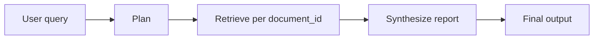

# Multi-Document Research Agent

An autonomous research-style agent that accepts a **comparative question**, plans retrieval steps, pulls evidence from **separate document corpora** (by id), and produces a **synthesized report**. Orchestration uses **LangGraph**; retrieval is exposed as a **LangChain tool** with a **mock backend** so you can swap in FAISS or another vector store later.

## Architecture



| Layer | Role |
|--------|------|
| **`main.py`** | CLI entry: runs a hardcoded comparative question. |
| **`agent/workflow.py`** | **LangGraph** `StateGraph`: `plan` → `retrieve` → `synthesize`. State holds the query, plan text, target document ids, accumulated retrieval results, and final report. |
| **`tools/retriever_tool.py`** | **`retrieve_document_chunks(query, document_id)`** — tool the agent calls per document. Currently returns **placeholder chunks** from `MOCK_DOCUMENTS`. |

### State flow

1. **Planning** — Decomposes the task and chooses `targets` (mock document ids). Replace with an LLM planner for arbitrary questions.
2. **Action (retrieve)** — For each `document_id`, invokes the retriever tool with the user query.
3. **Synthesis** — Merges chunks into a markdown report. Replace with an LLM + citations when `OPENAI_API_KEY` is configured.

## Setup

```bash
cd MultiDoc_Research_Agent
python -m venv .venv
source .venv/bin/activate   # Windows: .venv\Scripts\activate
pip install -r requirements.txt
```

Run:

```bash
python main.py
```

## Next steps

- Wire **real embeddings** and **FAISS** (or another index) inside `tools/retriever_tool.py`.
- Add an **LLM node** for planning and synthesis (`langchain-openai` is already listed in `requirements.txt`).
- Add **evaluation** and **logging** (e.g. LangSmith) for agent traces.

## License

Personal / educational use unless you add a license file.
