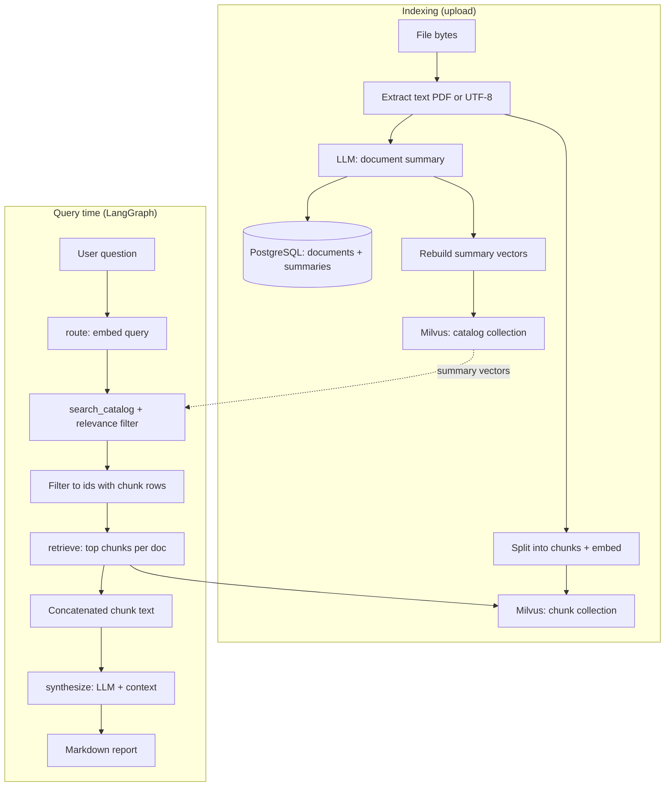
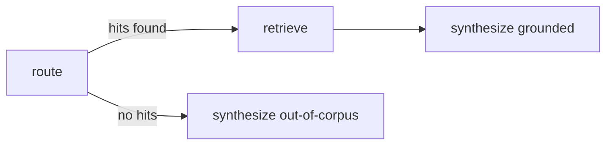

# Multi-Document Research Agent

RAG-style app: **document summaries** and **per-document chunk vectors** in **Milvus** power a **LangGraph** agent. Queries are **routed** by embedding against the **summary collection** (`MILVUS_COLLECTION_CATALOG`); only documents close enough to the best summary match are used (see **`CATALOG_ROUTE_L2_MARGIN`** and optional **`CATALOG_ROUTE_MAX_BEST_L2`** in `.env`). **Chunks** are then retrieved from those docs (up to **`CATALOG_ROUTE_TOP_K`**). Chat: **Ollama**, **Gemini**, or **Z.ai** via `zai-sdk` — see `.env.example`.

**Embeddings** default to **`EMBEDDING_PROVIDER=ollama`**; optional **`nvidia`** uses NeMo Retriever–compatible NVIDIA APIs (`langchain-nvidia-ai-endpoints`, **`NVIDIA_API_KEY`**). The full **`nemo-retriever`** stack is **not** required.

**Streamlit** (`app.py`) is the UI; **PostgreSQL** holds upload metadata and summaries.

## Pipeline (overview)



**In words:** each upload gets one **summary** vector in Milvus and many **chunk** vectors. At query time, summary search picks candidate documents; chunk search pulls evidence only from those docs.

## LangGraph shape



## Storage layout

| Location | Contents |
|----------|----------|
| **Milvus** `MILVUS_COLLECTION_CATALOG` | One **summary** vector per document (`document_id`). |
| **Milvus** `MILVUS_COLLECTION_CHUNKS` | Chunk text + vectors (scoped by `document_id`). |
| **`uploads/`** | Original files (local disk or optional MinIO). |
| **PostgreSQL** | `documents`: id, filename, `summary`, status, storage path. |

Optional **MinIO** in `docker-compose.yml` (API `9000`, console `9001`): set **`MINIO_*`** in `.env` for uploads. Milvus uses the **same** MinIO process with a **separate bucket** for segment storage.

## Setup

```bash
cd MultiDoc_Research_Agent
python -m venv .venv
source .venv/bin/activate   # Windows: .venv\Scripts\activate
pip install -r requirements.txt
cp .env.example .env        # DATABASE_URL, MILVUS_URI, embeddings, LLM
```

Use **Python 3.11+** (3.12 recommended if you hit grpc/pymilvus wheels issues on bleeding-edge Python).

### Docker: Postgres + MinIO + Milvus

```bash
docker compose up -d
```

Brings up **PostgreSQL**, **MinIO**, **etcd**, and **Milvus standalone** (gRPC **`19530`**). First start can take **1–2 minutes** until services are healthy.

- **pymilvus** and the **Milvus image** should stay on the **same minor** (e.g. 2.6.x together). See `requirements.txt` and `docker-compose.yml`. After changing the image: `docker compose pull && docker compose up -d`. Dev-only full reset: `docker compose down -v` (deletes Milvus/etcd data).
- Tables: `python -m catalog.cli init-db`
- Default **`MILVUS_URI=http://127.0.0.1:19530`**. Remote Milvus / Zilliz: set **`MILVUS_URI`** and **`MILVUS_TOKEN`** as in `.env.example`.

### Milvus / chunk index troubleshooting

| Symptom | What to try |
|--------|-------------|
| `MilvusException` **code 2** (“Fail connecting…”) | Align **pymilvus** with the **server image**; ensure **`NO_PROXY`** includes `127.0.0.1,localhost` if you use `HTTP_PROXY`; optional **`MILVUS_TIMEOUT_SEC=none`** in `.env`; **restart Streamlit** after editing `.env`. |
| Old **`[chunk index]`** error on a document | Stored on that DB row from a failed run. **Delete the doc and re-upload** to clear it and re-run ingest, or fix Milvus and upload again. |

## Run

**CLI (sample):**

```bash
python main.py
```

**Streamlit:**

```bash
streamlit run app.py
# or: ./run_streamlit.sh
```

See **`.env.example`** for `CATALOG_ROUTE_TOP_K`, `LLM_PROVIDER`, `EMBEDDING_PROVIDER`, `NVIDIA_API_KEY`, etc.

## Key modules

| Module | Role |
|--------|------|
| `catalog/milvus_catalog.py` | Milvus: rebuild summary index, search catalog + chunks. |
| `catalog/routing.py` | `route_query_to_documents`: summary search ∩ chunk-indexed ids. |
| `catalog/pipeline.py` | Upload pipeline, `rebuild_summary_catalog()`. |
| `catalog/upload_storage.py` | Local `uploads/` or optional MinIO. |
| `ingest.py` | Chunk, embed, upsert into Milvus. |
| `agent/llm.py` | Chat LLM + embeddings. |
| `agent/workflow.py` | LangGraph: route → retrieve → synthesize. |
| `tools/retriever_tool.py` | Chunk retrieval per `document_id`. |
| `app.py` | Streamlit UI. |

## License

Personal / educational use unless you add a license file.
