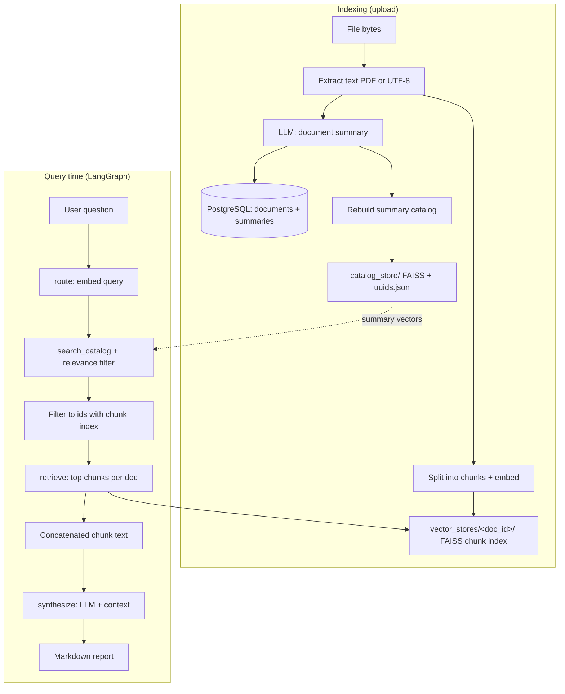
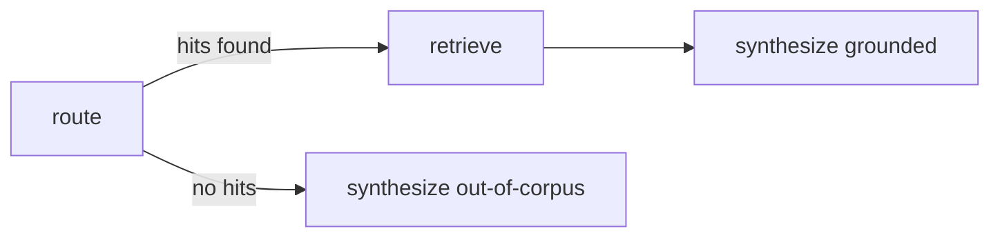

# Multi-Document Research Agent

RAG-style app: **document summaries** and **per-document chunk indexes** back a **LangGraph** agent. Queries are **routed** by embedding against the summary index (`catalog_store/`): only documents **close enough** to the best summary match are used (see **`CATALOG_ROUTE_L2_MARGIN`** and optional **`CATALOG_ROUTE_MAX_BEST_L2`** in `.env`). Then **chunks** are fetched from those docs (up to **`CATALOG_ROUTE_TOP_K`**). Use **Ollama**, **Gemini**, or **Z.ai** (GLM-4.7-Flash via `zai-sdk`) for chat (see `.env.example`). **Embeddings** stay on **Ollama** so vectors remain consistent. **Streamlit** (`app.py`) provides the UI; **PostgreSQL** stores upload metadata and summaries.

## Pipeline (overview)



**Flow in words:** each upload gets **one embedding per document** (LLM summary → `catalog_store/`) and **many embeddings per document** (chunks → `vector_stores/<id>/`). At query time, summary search picks the **closest** document(s); chunk search then pulls evidence from those docs only.

## LangGraph shape



## Storage layout

| Path | Contents |
|------|----------|
| **`catalog_store/catalog.faiss`** | FAISS index over **document-level** embedding vectors (LLM summaries). |
| **`catalog_store/uuids.json`** | Maps FAISS row index → PostgreSQL **document UUID**. |
| **`vector_stores/<document_id>/`** | Per-document **chunk** FAISS (`index.faiss`) + LangChain docstore (`index.pkl`). |
| **`uploads/`** | Original uploaded files. |
| **PostgreSQL** | `documents` table: id, filename, `summary`, status, paths. |

## Setup

```bash
cd MultiDoc_Research_Agent
python -m venv .venv
source .venv/bin/activate   # Windows: .venv\Scripts\activate
pip install -r requirements.txt
cp .env.example .env        # set DATABASE_URL, Ollama and/or Gemini
```

Start Postgres (example):

```bash
docker compose up -d
```

Create tables (if needed): `python -m catalog.cli init-db`

## Run

**CLI (sample question):**

```bash
python main.py
```

**Streamlit UI:**

```bash
streamlit run app.py
# or: ./run_streamlit.sh
```

Routing and LLM options: **`.env`** (see **`.env.example`**): `CATALOG_ROUTE_TOP_K`, `LLM_PROVIDER`, `GEMINI_API_KEY`, etc.

## Key modules

| Module | Role |
|--------|------|
| `catalog/ivf_pq_faiss.py` | Build / save / **search** the summary FAISS catalog. |
| `catalog/routing.py` | `route_query_to_documents`: summary search ∩ chunk-indexed ids. |
| `catalog/pipeline.py` | Upload pipeline, `rebuild_summary_catalog()` from DB. |
| `ingest.py` | `build_chunk_index_for_text` for chunk FAISS (used by pipeline). |
| `agent/llm.py` | `get_chat_llm` (Ollama, Gemini, or Z.ai), `get_embeddings` (Ollama). |
| `agent/workflow.py` | LangGraph: `route` → `retrieve` → `synthesize`. |
| `tools/retriever_tool.py` | Chunk retrieval for one `document_id`. |
| `app.py` | Streamlit UI. |

## License

Personal / educational use unless you add a license file.
